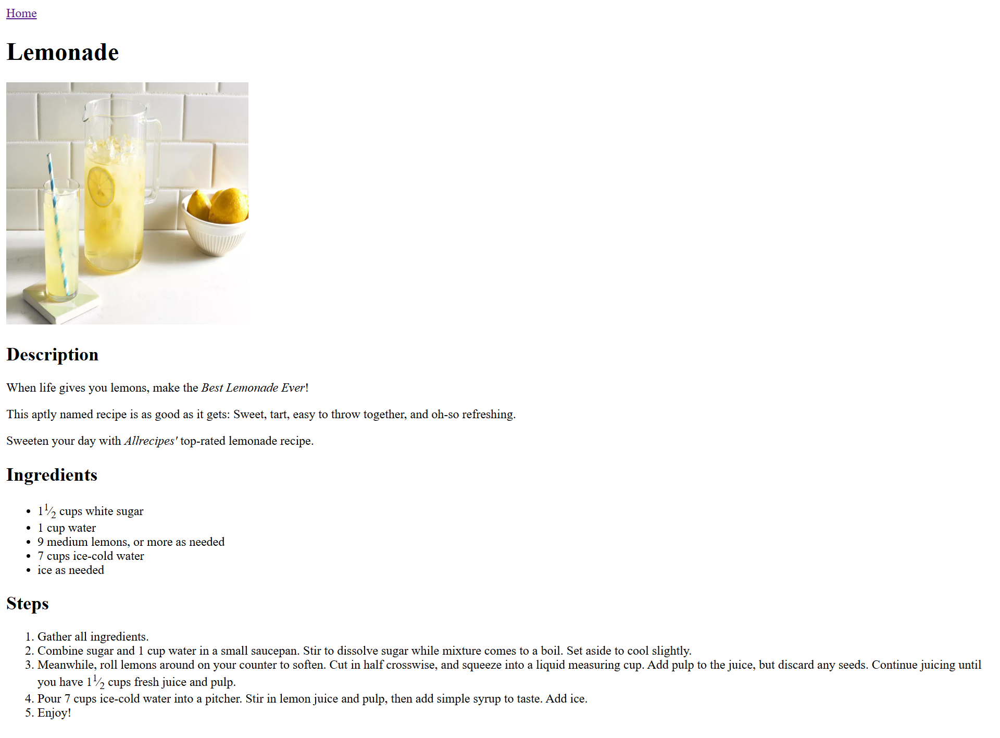

# Odin Recipes

This is a simple recipe website created with HTML.

**[See it live!](https://4bdullah7eeshan.github.io/odin-recipes/)**

## Screenshots

### Homepage


### Recipe Pages

#### Lasagna Recipe Page


#### Pancake Recipe Page


#### Lemonade Recipe Page




## Project Structure

Here is a bird-eye view of the *core* items of this project

```
├── README.md
├── index.html
└── recipes/
    ├── lasagna.html
    ├── lemonade.html
    └── pancake.html
```

## Getting Started

```bash
git clone git@github.com:4bdullah7eeshan/odin-recipes.git
cd odin-recipes
```

## Background

This website was created as part of [The Odin Project](https://www.theodinproject.com/)'s [Recipe](https://www.theodinproject.com/lessons/foundations-recipes) project.

### To Odinites

Thanks for being here :heart: !

This is a revisit to the project as part of my second iteration of the TOP curriculum.

Good luck on your learning journey!

## Credits

The recipes are taken from [Allrecipes](https://www.allrecipes.com/).

## License

This project is licensed under the Apache License, Version 2.0 (the “License”).

You can do *anything* you want with the code. 
